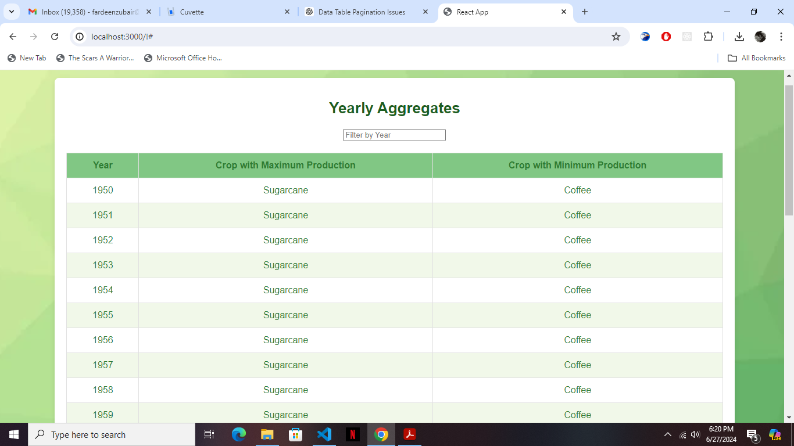
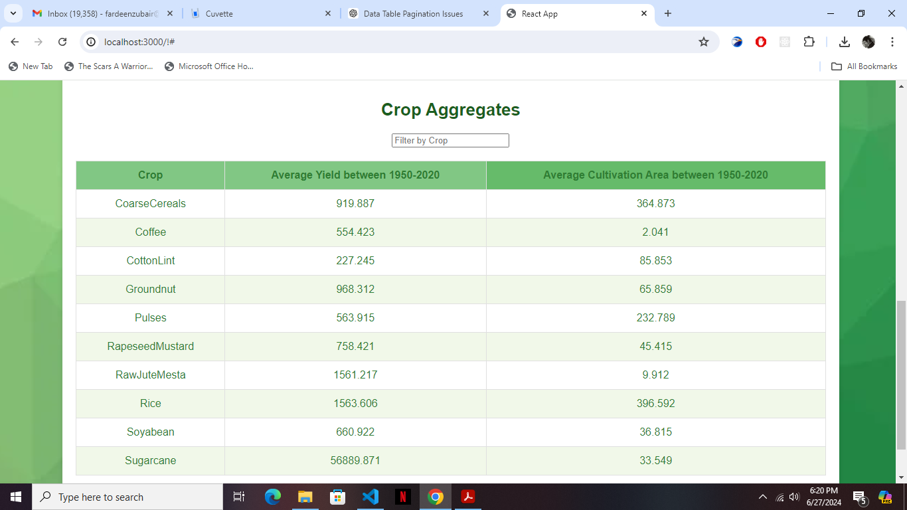

# Agriculture Data Analysis

This project analyzes Indian agriculture data and presents it in tables using React and Mantine. It includes features for filtering, sorting, and pagination of data.

## Features

- Display yearly aggregates of crop production, showing crops with maximum and minimum production each year.
- Display crop aggregates, including average yield and average cultivation area between 1950-2020.
- Filter crops by name to quickly find specific crop data.
- Paginate through large datasets to improve usability.

## Installation

Before running the project, make sure you have Node.js and Yarn installed on your machine.

1. Clone the repository:
   git clone https://github.com/your-username/agriculture-data-analysis.git

2. Navigate into the project directory:
   cd agriculture-data-analysis

3. Install dependencies:
   yarn install

4. To start the development server and view the project:
    yarn start
    Open `http://localhost:3000` to view it in the browser.

## Screenshots

*Yearly Aggregates Table*

*Crop Aggregates Table*

## Project Structure
`public/` - Static assets and `index.html.`
`src/`
`components/` - React components including `DataTable.js` and `Pagination.js`.
`utils/` - Utility functions like data loading and aggregation.
`App.js` - Main application component.
`App.css` - Styles for the application.
`index.js` - Entry point for React rendering.

## Notes
Ensure the `crop-background.svg` is placed in the `public` directory for the background image to display correctly.
Adjustments to styling and functionality can be made in the source files under `src/`.

## Technologies Used
1. React
2. Mantine
3. JavaScript/TypeScript
4. Yarn

## Acknowledgments
1. Data sourced from the National Data and Analytics Platform, NITI Aayog.
2. Inspired by projects focusing on data visualization and UI/UX design.

## Author
Fardeen Zubair
`fardeenzubair@gmail.com`